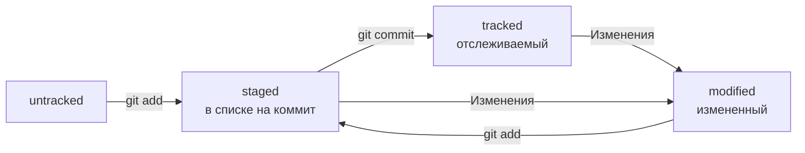

# Шпаргалка Git


### Командная строка Linux

#### Навигация
`pwd` - напечатать путь до текущей директории  
`ls` - показать содержимое директории  
`ls -la` - показать все, в том числе скрытые файлы и папки директории     
`cd` - перейти в новую директорию


#### Файлы и папки
`touch` - создать файл  
`mkdir` - создать папку


`cp` - скопировать файл  
`mv` - перенести (вырезать и вставить) файл  
`cat` - вывести содержимое файла

`rm` - удалить файл  
`rmdir` - удалить пустую папку  
`rm -rf` - удалить папку и всё её содержимое рекурсивно  


### Команды Git

#### Первичные настройки

`git config --global user.name "John Doe"` - установить имя пользователя  
`git config --global user.email johndoe@example.com` - установить почту пользователя  
`git config --list` - показать список всех настроек  

`git config --global init.defaultBranch main` - установить название первой ветки main (по умолчанию master)  

`git init` - сделать git репозиторий из текущей папки  
`rm -rf .git` - превратить текущий git репозиторий в обычную папку


`git status` - показать добавленные файлы в индекс (`git add`), модифицированные файлы, неотслеживаемые файлы в текущем git репозитории  

#### Статусы файлов в репозитории
* Untracked - новые файлы в репозитории  
* Modified - изменненные файлы, не добавленные в индекс (`git restore <file>...` - сбросить изменения файла)  
* Staged - добавленные в индекс файлы (`git restore --staged <file>...` - удалить файл из индекса)  


`git log` -  вывести список коммитов в текущей ветке  
`git log --oneline` -  вывести минимально необходимую краткую версию хэша коммита и 72 первых символа сообщения коммита


`git add` - добавить файлы в индекс  
`git commit -m "<message>"` - зафиксировать файлы в индексе в истории репозитория  


`git checkout <branch name>` - перейти на уже созданную ветку `<branch name>`  
`git checkout -b <branch name>` - перейти на новую ветку `<branch name>`  

### Оформление сообщений коммитов

Хорошо, когда:  
* сообщение коммита легко читается;
* оно информативное;
* все сообщения оформлены в одном стиле.


#### Корпоративный стиль

```<JIRA ID>: <description>```, где

JIRA ID:  
уникальный идентификатор в системе управления проектами (например, JIRA, ActiveCollab и т.п.) 

description:  
инфинитив + описание выполненной работы

#### Стиль Conventional Commits

```<type>: <description>```, где


type:  
`feat` - новая функциональность  
`fix` - исправление бага

description:  
инфинитив глагола расском языке (или императив на английском) + описание выполненной работы

Подробнее в [Соглашение о коммитах](https://www.conventionalcommits.org/ru/v1.0.0-beta.4/#%D1%81%D0%BF%D0%B5%D1%86%D0%B8%D1%84%D0%B8%D0%BA%D0%B0%D1%86%D0%B8%D1%8F "www.conventionalcommits.org")

#### Стиль GitHub

```Исправить #<issue>, добавить график температуры```, где  

issue - номер задачи в GitHub


### Жизненный цикл Git



### Редактируем последний коммит (HEAD)
`git commit --amend --no-edit` - добавить файлы в индексе в последний коммит  
`git commit --amend -m "<message>"` - добавить файлы в индексе в последний коммит и изменить сообщение коммита  
`git commit --amend` - добавить файлы в индексе в последний коммит, открыть редактор (nano, vim) и изменить сообщение коммита вручную  
Важно:  
редактируйте последний коммит только если он еще отсутствует в удаленном репозитории. Иначе кто-то уже мог захватить ваш коммит и при повторном затягивании проекта у этого пользователя появятся конфликты слияния.


### Откатываем изменения
`git restore --staged <file>` - выполнить unstage изменений в файле  (staged -> modified / untracked)  
`git restore <file>` - сбросить несохраненные изменения в файле («откатит» изменения в файле до последней сохранённой (в коммите или в staging) версии.)  

`git reset --hard <commit hash>` - «откатить» коммит. Использовать осторожно, изменения необратимы!    


