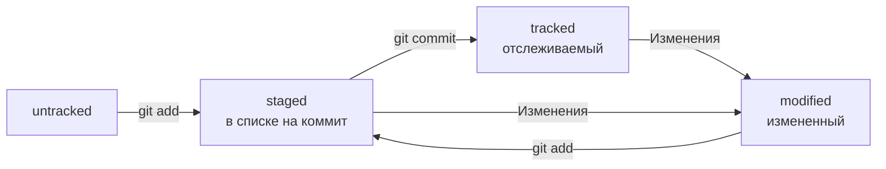

# Шпаргалка Git


### Командная строка Linux

#### Навигация
`pwd` - напечатать путь до текущей директории  
`ls` - показать содержимое директории  
`ls -la` - показать все, в том числе скрытые файлы и папки директории     
`cd` - перейти в новую директорию


#### Файлы и папки
`touch` - создать файл  
`mkdir` - создать папку


`cp` - скопировать файл  
`mv` - перенести (вырезать и вставить) файл  
`cat` - вывести содержимое файла

`rm` - удалить файл  
`rmdir` - удалить пустую папку  
`rm -rf` - удалить папку и всё её содержимое рекурсивно  

`echo "<text>" >> file.txt` - добавить <text> в конце текстового файла `file.txt`  
`echo "<text>" > file.txt` - заменить содержимое текстового файла `file.txt` на `<text>`  


### Команды Git
#### Первичные настройки
`git config --global user.name "John Doe"` — установить имя пользователя  
`git config --global user.email johndoe@example.com` — установить почту пользователя  
`git config --list` — показать список всех настроек  

`git config --global init.defaultBranch main` — установить название первой ветки `main` (по умолчанию `master`)  

`git init` — сделать git репозиторий из текущей папки  
`rm -rf .git` — превратить текущий git-репозиторий в обычную папку  

`git remote add origin https://github.com/<username>/<projectname>.git` — привязать локальный репозиторий к удалённому с URL `https://github.com/<username>/<projectname>.git`  
`git remote -v` — проверить, что репозитории действительно связались  
`git push -u origin main` — в первый раз загрузи все коммиты из локального репозитория в удалённый с названием `origin`  
`git push` (от англ. push, «толкать») — загрузить коммиты в удалённый репозиторий после того, как он был привязан с помощью флага `-u`.  


#### Статусы файлов в репозитории
* Untracked — новые файлы в репозитории  
* Modified — изменненные файлы, не добавленные в индекс (`git restore <file>...` - сбросить изменения файла)  
* Staged — добавленные в индекс файлы (`git restore --staged <file>...` - удалить файл из индекса)  

`git status` — показать добавленные файлы в индекс (`git add`), модифицированные файлы, неотслеживаемые файлы в текущем git репозитории  


#### Просмотр информации о коммитах
`git log` —  вывести список коммитов в текущей ветке  
`git log --oneline` —  вывести сокращённый хеш коммита (необходимый минимум) и 72 первых символа сообщения коммита


#### Подготовка файла к коммиту
`git add todo.txt` — добавить файл `todo.txt` в индекс  
`git add --all` (от англ. _add_, «добавить» + _all_, «всё») — подготовить к коммиту сразу все файлы, в которых были изменения, и все новые файлы  
`git add .` — подготовить к коммиту текущую папку и все файлы в ней  


#### Создание и публикация коммита
`git commit -m "<message>"` — зафиксировать файлы в индексе в истории репозитория  
`git push` (от англ. _push_, «толкать») — добавить изменения в удалённый репозиторий


### Оформление сообщений коммитов
Хорошо, когда:  
* сообщение коммита легко читается;
* оно информативное;
* все сообщения оформлены в одном стиле.


#### Корпоративный стиль
```<JIRA ID>: <description>```, где

JIRA ID:  
уникальный идентификатор в системе управления проектами (например, JIRA, ActiveCollab и т.п.) 

description:  
инфинитив + описание выполненной работы


#### Стиль Conventional Commits
```<type>: <description>```, где

type:  
`feat` — новая функциональность  
`fix` — исправление бага

description:  
инфинитив глагола расском языке (или императив на английском) + описание выполненной работы

Подробнее в [Соглашение о коммитах](https://www.conventionalcommits.org/ru/v1.0.0-beta.4/#%D1%81%D0%BF%D0%B5%D1%86%D0%B8%D1%84%D0%B8%D0%BA%D0%B0%D1%86%D0%B8%D1%8F "www.conventionalcommits.org")


#### Стиль GitHub
```Исправить #<issue>, добавить график температуры```, где  

issue - номер задачи в GitHub


### Жизненный цикл Git



### Редактируем последний коммит (HEAD)
`git commit --amend --no-edit` — добавить файлы в индексе в последний коммит  
`git commit --amend -m "<message>"` — добавить файлы в индексе в последний коммит и изменить сообщение коммита  
`git commit --amend` — добавить файлы в индексе в последний коммит, открыть редактор (`nano`, `vim`) и изменить сообщение коммита вручную  
Важно:  
редактируйте последний коммит только если он еще отсутствует в удаленном репозитории. Иначе кто-то уже мог захватить ваш коммит и при повторном затягивании проекта у этого пользователя появятся конфликты слияния.


### Откатываем изменения
`git restore --staged hello.txt` (от англ. _restore_, «восстановить») — выполнить unstage изменений в файле `hello.txt` (staged -> modified / untracked)  
`git restore hello.txt` — вернуть файл `hello.txt` к последней версии, которая была сохранена через `git commit` или `git add`  

`git reset --hard b576d89`(от англ. _reset_, «сброс», «обнуление» + _hard_, «суровый»)  — удалить все незакоммиченные изменения из индекса и «рабочей зоны» вплоть до коммита `b576d89`. Использовать осторожно, изменения необратимы!  


### Просматриваем изменения в файлах
`git diff` — сравнить последнюю закоммиченную версию файла с той, что находится в состоянии modified  
`git diff --staged` — показать изменения в staged-файлах относительно последних закоммиченных версий  
`git diff <commit1 hash> <commit2 hash>` — сравнить изменения между коммитами  


### Игнорируем файлы
`.gitignore` — специальный файл в корне репозитория, которых содержит правила для git. Правила указывают, какие файлы untracked нужно игнорировать.  

`git status --ignored` — посмотреть, что игнорируется  
```
# вот так можно писать комментарии;
# они ничего не значат для .gitignore,
# но они могут быть полезны, чтобы понять, зачем было добавлено то или иное правило
```


#### Правила .gitignore
* Просто **название файла** — Git будет игнорировать файлы с указанным именем 
```
# для macOS
.DS_Store
```

* **Символ звёздочки** (`*`) соответствует любой строке, включая пустую
```
# игнорировать все файлы, которые заканчиваются на .jpeg
*.jpeg

# игнорировать все файлы "tmp" во всех подпапках папки docs
docs/*/tmp

# странное, но возможное правило
# "игнорировать все файлы"
* 
```

* **Вопросительный знак** (`?`) соответствует одному любому символу.
```
# Будут проигнорированы, например, файлы fileA.txt и file1.txt. 
# А вот файл file12.txt не будет проигнорирован
file?.txt
```

* **Квадратные скобки**, как и вопросительный знак, соответствуют одному символу. При этом символ не любой, а только из списка, который указан в скобках.  
```
# игнорировать файлы file0.txt, file1.txt и file2.txt
# при этом не игнорировать file3.txt, file4.txt, ...
# В скобках можно либо перечислить символы ([abc]), либо задать диапазон ([a-z]).
file[0-2].txt
```

* **Косая черта**, или слеш (/), указывает на каталоги. 
```
# игнорировать todo.txt в корне репозитория
/todo.txt

# для сравнения: spam.txt будет игнорироваться во всех папках
spam.txt

# игнорировать папку build.
# Если build — обычный файл, то он не подпадёт под правило и не будет игнорироваться.
build/
```

* Функция **парных звёздочек** (**) похожа на функцию одинарной (*). Отличие в том, как они работают с вложенными папками. Двойная звёздочка может соответствовать любому количеству таких папок (в том числе нулю). Одинарная может соответствовать только одной.

```
# игнорировать файлы "docs/current/tmp", "docs/old/tmp",
# а также "docs/old/saved/a/b/c/d/tmp"
# и даже "docs/tmp", потому что ноль вложенных папок тоже подходит
docs/**/tmp

# игнорировать только "docs/current/tmp" и "docs/old/tmp"
# файл "docs/old/saved/a/b/c/d/tmp" не попадает в правило
docs/*/tmp
```

* Любое правило в файле .gitignore можно инвертировать с помощью **восклицательного знака** (!).
```
# игнорировать все JPEG-файлы
*.jpeg

# но только не мем с Doge
!doge.jpeg
```


### Изучаем историю изменений
`git diff` (от англ. _difference_, «отличие», «разница») — показать изменения в «рабочей зоне», то есть в modified-файлах  
`git diff a9928ab 11bada1` — вывести разницу между двумя коммитами  
`git diff --staged` — показать изменения, которые добавлены в staged-файлах  


## Погружение в работу с ветками


### Клонирование
`git clone git@github.com:YandexPraktikum/first-project.git` - склонировать репозиторий с URL `..first-project.git` из аккаунта YandexPraktikum на мой локальный компьютер  


### Создание
`git branch feature/add-branch-info` - создать ветку feature/add-branch-info от текущей ветки  
`git checkout -b <branch name>` — создать и перейти на новую ветку `<branch name>`  


### Навигация
`git branch` - вывести список веток проекта  
`git branch -a` — показать все известные ветки, как локальные (в локальном репозитории), так и удалённые (в `origin`, или на GitHub)  
`git checkout <branch name>` — перейти на уже созданную ветку `<branch name>`  


### Сравнение
Можно сравнивать коммиты, ветки, HEAD  
Символ `~` символ навигации. Он отсчитывает от заданного коммита N коммитов назад во времени.  
Примеры:  
`git diff main develop` - показать разницу между веткой `main` и `develop`  
`git diff main~ main` - показать разницу между предпоследним коммитом в `main` и `main`  
`git diff main~3 main` - показать разницу между тем коммитом, который был три коммита назад, и текущим  
`git diff main develop`  
`git diff 068a9b1~ 068a9b1`  


### Удаление веток
`git branch -D br-name` - удалить ветку `br-name` после объединения   
`git branch -d br-name` - удалить ветку `br-name`, только если она была полностью объединена с `main` — то есть если две ветки стали (или изначально были) частью одной истории  


### Слияние веток
`git merge main` - объединить ветку `main` с текущей активной веткой  
`git merge --no-edit main` - объединить, используя сообщение коммита по умолчанию (без всплывающего окна редактирования)  


### Работа с удалённым репозиторием
`git push -u origin feature/new` - отправить новую локальную ветку в удаленный репозиторий и связать локальную и удаленную копии ветки  
`git push my-branch` -  отправь дополнительные изменения в ветку `my-branch`, которая уже существует в удалённом репозитории  
`git push` - отправить текущую ветку в удаленный репозиторий  
`git pull` - забрать изменения из удалённого репозитория  


### Изменение удаленного репозитория
`git remote rm origin` - удалить `origin` для текущего репозитория  
`git remote add origin git@github.com:%ВАШ_АККАУНТ%/%ВАШ_РЕПОЗИТОРИЙ%.git` - добавить новый `origin` для текущего репозитория


### Подготовка ветки к pull request
```bash
$ git checkout main # перешли в main
$ git pull # подтянули новые изменения в main
$ git checkout my-branch # вернулись в рабочую ветку my-branch
$ git merge main # влили main в новую ветку my-branch
$ git push -u origin my-branch # отправили ветку my-branch в удалённый репозиторий
```


### Состояние перемотки (fast forward)
Две ветки находятся в состоянии fast-forward, если одну из них можно «перемотать» вперёд и она будет содержать те же коммиты, что и другая.  
Это утверждение можно сформулировать иначе:

* при слиянии этих двух веток никак не возможен конфликт;
* истории этих двух веток не «разошлись»;
* одна ветка является продолжением другой.

`git merge --no-ff main` - объединить ветку `main` с текущей активной веткой с принудительным созданием **коммита слияния** (англ. _merge commit_)  
`git config merge.ff false` - отключить слияние в режиме `fast forward` в настройках репозитория - [merge.ff](https://git-scm.com/docs/git-merge#Documentation/git-merge.txt-mergeff)  
`git config --global merge.ff false` - отключить слияние в режиме `fast forward` для всех репозиториев по-умолчанию  
`git log --graph --oneline` - показать историю репозитория с графом веток, нарисованных с помощью «палочек» и «звёздочек»  

* Если истории двух веток всё же «разошлись», при слиянии веток Git создаст коммит слияния.
* При объединении веток в состоянии не-fast-forward возможны (но не обязательны) конфликты.
* Если конфликты всё же возникли, Git попытается разрешить их самостоятельно или попросит вас сделать это вручную.


### Расхождение историй веток (non fast forward)
Две ветки в состоянии non fast forward, если в каждой из веток есть коммиты, которые отсутствуют в другой.

Если возникает состояние non fast forward между локальной и удаленной версиями одной ветки, возможны решения:  
A) `git rebase` - перебазировать начало локальной ветки на последний коммит в удаленной ветке  
B) `git push --force` - перезаписать удаленную ветку локальной копией (ветка в удаленном репозитории полностью заменяется на локальную, конфликтные коммиты пропадут!)  


## Стратегии работы с ветками
Подходы к работе с ветками — это правила, которые описывают, когда и для чего создаются ветки, какие в них коммиты и в какой момент происходит слияние веток.

**Feature branch workflow** — простой и самый популярный вариант. В нём для каждого нового изменения создаётся новая ветка, которая позже вливается в main с помощью `git merge`. При таком подходе все коммиты в ветке `main` — это коммиты слияния (feature-ветки вливаются в `main`).
Основные правила:  
* новая функциональность или исправление — новая ветка;
* когда код в feature-ветке готов, он вливается в main;
* в main всегда рабочая версия без «недоделок».  
Преимущества:  
* простая модель;
* позволяет работать с Git в команде без лишних технических сложностей.  
Ключевая особенность: одна ветка main и много feature-веток, которые вливают в основную.

    
**Git flow** — более сложный вариант. Подход похож на _feature branch workflow_, но в нём создаётся больше веток, а изменения (коммиты) делят на разные типы: исправление, новая функциональность и так далее. Разные типы коммитов попадают в разные ветки.  
**Trunk-based** — популярный в больших компаниях (таких как Яндекс, Google и прочих) подход, который обещает бо́льшую скорость работы в крупных командах.
Этот подход тоже похож на _feature branch workflow_. Главное отличие в том, что участники проекта вливают (`merge`) свой код в основную ветку максимально часто. Например, каждый день.


### Ревью
Многие команды уделяют особое внимание процессу ревью, потому что оно выполняет сразу две важные функции:  
* проверяется качество и необходимость предлагаемых изменений;
* те, кто выполняет ревью, узнают подробности о новых изменениях в проекте.

Для оценки качества изменений выделяют такие критерии:  
* стиль изменений (стиль кода) совпадает с принятым в проекте;
* нет очевидных проблем — ошибок, или **багов** (от англ. _bug_, «жук»), а также уязвимостей — так называемых «дырок», через которые можно взломать систему;
* нет ничего лишнего — иногда опытный участник знает, как сделать то же самое проще, чем предлагается в пул-реквесте.

### Жизненный цикл PR на Github (open source)
1. Автор делает `fork` репозитория, создает новую `feature` ветку, создаёт PR ветки в `main` основного репозитория.
2. Ревьюер просматривает изменения и предлагает правки, если они необходимы.
3. Автор вносит исправления по комментариям ревьюера.
4. Второй и третий пункты могут повториться!
5. Если ревьюера всё устраивает, он одобряет («апрувит») пул-реквест.
6. Вуаля! Теперь ревьюер могут влить изменения в основную ветку.


